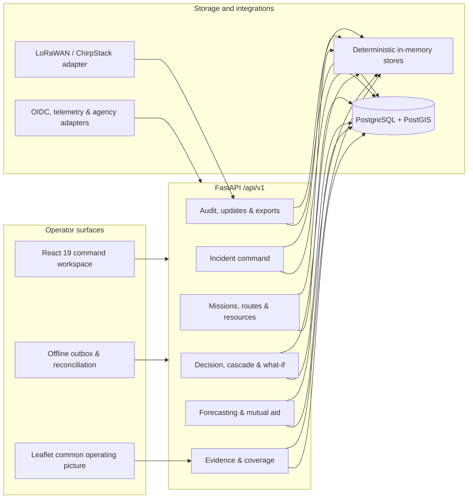
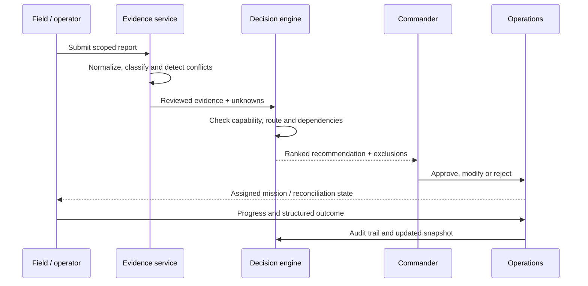

<div align="center">

# PROJECT DRISHTI

### *Human-Supervised Disaster Intelligence, Response & Incident Command Platform*

<p align="center">
  
</p>

[](https://github.com/veenit-cell/DRISHTI/actions/workflows/verification.yml)
[](https://www.python.org/)
[](https://react.dev/)
[](https://fastapi.tiangolo.com/)
[](https://postgis.net/)
[](#current-status)

**From uncertain field reports to accountable, commander-approved action.**

[Overview](#executive-summary) · [Capabilities](#core-capabilities) · [Architecture](#system-architecture) · [Run locally](#run-locally) · [Validation](#engineering-and-validation) · [Safety](#safety-boundary)

</div>

---

## Executive summary

**DRISHTI**—also presented in the product as **RescueOps**—is an operations workspace for the first hours of a disaster. It helps a response team turn incomplete, stale, contradictory, or geographically uneven evidence into missions that remain reviewable by a human commander.

The platform combines a React command workspace with a FastAPI decision-support backend, deterministic policy logic, offline command reconciliation, and PostgreSQL/PostGIS persistence. Every recommendation retains its evidence, exclusions, assumptions, policy version, and approval history.

```text
Activate incident → assign sectors → ingest reports → review evidence
→ expose coverage gaps → create mission → check route and capability
→ commander approval → field updates → outcome → shift handover
```

> [!IMPORTANT]
> DRISHTI is a supervised **tabletop/demo system**. It is not an autonomous dispatcher, public-alert authority, or certified production system for live emergency operations.

## The operational problem

Disaster response is not simply a queue sorted by report count. Connected areas can dominate attention while isolated settlements go silent. A nearby team may lack the required capability, already be committed, or be unable to cross a blocked corridor. A plausible report may also be stale, duplicated, or contradicted.

| Conventional failure mode | DRISHTI response |
|---|---|
| No reports are interpreted as no need | Unassessed and communications-dark areas remain visible as **coverage debt** |
| Every report appears equally trustworthy | Source, age, confidence, conflicts, and review state travel with the evidence |
| Nearest resource is treated as best resource | Readiness, capability, commitment, and route feasibility are checked first |
| Recommendations become opaque instructions | Reasons, exclusions, assumptions, expiry, and policy versions are preserved |
| Connectivity loss hides work or creates false certainty | Commands remain explicitly queued until reconciliation succeeds |
| Shift change loses decision context | SITREP, outcome, audit, and handover records retain the operational trail |

## Core capabilities

### 1. Common operating picture

- Incident activation, pause, resume, closure, and sector assignment
- Map-oriented operational workspace with bounded spatial features
- Shelter state, route conditions, infrastructure dependencies, and resource readiness
- Update health states for connected, reconnecting, stale, and offline operation

### 2. Evidence trust and verification

- Immutable original reports with normalization provenance
- Claim-level states: corroborated, contradicted, unknown, stale, or pending review
- Duplicate and contradiction visibility
- Verification queues that prioritize information value, including silent areas

### 3. Capability-aware mission control

- Mission creation from reviewed evidence
- Resource matching by capability, readiness, availability, and route constraints
- Explicit commander approve, reject, modify, pause, and override actions
- Task lifecycle from assignment through acknowledgement, arrival, completion, and outcome

### 4. Decision support—not decision replacement

- Deterministic recommendation ranking and feasibility checks
- Infrastructure dependency graph and cascade analysis
- Multi-horizon runway projections and what-if scenarios
- Plans, selective invalidation, decision certificates, and mutual-aid drafts

### 5. Degraded-mode operations

- Browser-local outbox for reports and task commands
- Per-command pending, conflict, rejected, and reconciled states
- Printable mission packets and last-known-state timestamps
- Synthetic tabletop replay for connectivity loss, blocked routes, duplicates, and silent locations

### 6. Accountability and resilience

- Tenant/workspace scopes and role-based authorization boundaries
- Idempotency keys, correlation IDs, bounded request bodies, rate limits, and problem+json errors
- Append-oriented audit events, recommendation provenance, and outcome records
- Production startup fails closed without external identity and telemetry adapters

## Operator workspace

The React interface is organized around seven operational views:

| View | Purpose |
|---|---|
| **Command** | Incident overview, priorities, decisions, and operational brief |
| **Map** | Spatial awareness, coverage gaps, routes, shelters, and field state |
| **Reports** | Evidence intake, claim review, contradictions, and verification |
| **Missions** | Approval queue, assignment, lifecycle, and outcomes |
| **Resources** | Teams, vehicles, equipment, readiness, and capability |
| **Logistics** | Forecasts, infrastructure dependencies, and mutual aid |
| **Handover** | SITREP export, audit context, replay, and tabletop exercises |

## System architecture



### Decision path



## Technology stack

| Layer | Technologies |
|---|---|
| Frontend | React 19, TypeScript 5.9, Vite 7, Leaflet / React-Leaflet |
| Backend | Python 3.12–3.13, FastAPI, Pydantic Settings, Uvicorn |
| Data | PostgreSQL 17, PostGIS 3.5, psycopg; in-memory development adapters |
| Field integration | LoRaWAN / ChirpStack MQTT boundary, modular telemetry adapters |
| Testing | pytest, Ruff, Vitest, Testing Library, Playwright, axe-core, k6 |
| Delivery | Docker Compose, GitHub Actions, Vercel/Railway configuration |

## Run locally

### Prerequisites

- Python 3.12 or 3.13
- Node.js 22+ and npm
- Docker Desktop with Compose *(optional, for PostgreSQL/PostGIS mode)*

### 1. Install dependencies

Linux/macOS:

```bash
python3 -m venv .venv
.venv/bin/python -m pip install -e "./backend[dev]"
npm --prefix frontend ci
```

Windows PowerShell:

```powershell
py -3.13 -m venv .venv
.\.venv\Scripts\python.exe -m pip install -e ".\backend[dev]"
npm.cmd --prefix frontend ci
```

See the [Windows setup guide](README-WINDOWS.md) for the scripted workflow.

### 2. Start the API

```bash
cd backend
../.venv/bin/uvicorn app.main:app --reload --host 127.0.0.1 --port 8000
```

On Windows, use `..\.venv\Scripts\python.exe -m uvicorn app.main:app --reload --host 127.0.0.1 --port 8000`.

When PostgreSQL is unavailable, development mode uses deterministic in-memory stores. This data resets when the API restarts.

### 3. Start the operator workspace

```bash
npm --prefix frontend run dev
```

Open `http://127.0.0.1:5173`. Interactive API documentation is available at `http://127.0.0.1:8000/docs` outside production.

### PostgreSQL/PostGIS mode

```bash
docker compose -f infra/compose.yaml up -d --wait
cd backend
../.venv/bin/python -m app.persistence
../.venv/bin/uvicorn app.main:app --reload --host 127.0.0.1 --port 8000
```

The development database URL defaults to `postgresql://postgres@127.0.0.1:5432/ev2`. Migrations are forward-only through `0024_recommendation_queue_provenance.sql`.

### Development identity

```bash
curl -H "X-Dev-Identity: operator" http://127.0.0.1:8000/api/v1/dev/context
```

This identity is a local fixture only. Production mode disables it and requires an injected OIDC verifier.

## API surface

All application endpoints live under `/api/v1`.

| Domain | Representative endpoints |
|---|---|
| System | `/health/live`, `/health/ready`, `/version`, `/metrics` |
| Incident command | `/command/incidents`, `/command/incidents/{id}/sectors` |
| Evidence | `/reports`, `/reports/{id}/review`, `/map/features` |
| Coverage | `/coverage/cells`, `/coverage/verification-ranking` |
| Operations | `/missions`, `/resources`, `/route-observations`, `/tasks` |
| Decisions | `/decision-loop/recommendations`, `/plans`, `/decision-certificates` |
| Mutual aid | `/resource-forecasts`, `/resource-requests/{id}/approve` |
| Resilience | `/offline-sync`, `/exports/sitrep`, `/pilot/exercises/tabletop` |
| Field telemetry | `/telemetry/summary`, LoRaWAN ingestion and webhook routes |

Client integrators should first read the [roles and scopes](contracts/v1/roles-and-scopes.md), [contract glossary](contracts/v1/glossary.md), and versioned JSON schemas in [`contracts/v1`](contracts/v1).

## Engineering and validation

The repository currently contains:

- **99** FastAPI route declarations
- **23** forward-only SQL migrations
- **180** backend test functions
- **65** backend/frontend test and spec files
- CI jobs for frontend, backend, security, PostGIS integration, browser accessibility, deployment smoke, and opt-in load testing

### Local checks

```bash
# Backend
cd backend
../.venv/bin/ruff format --check app tests
../.venv/bin/ruff check app tests
../.venv/bin/python -m pytest -q

# Frontend
cd ../frontend
npm run typecheck
npm run build
npm test
```

### Verification boundaries

| Environment | What it verifies | What it does not prove |
|---|---|---|
| In-memory backend | Deterministic domain behavior and API contracts | Database migrations or deployed isolation |
| Compose integration | PostGIS migrations, adapters, and scope assertions | A production identity or agency integration |
| Browser fixtures | Operator workflow and accessibility states | Live feeds, real authentication, or field outcomes |
| Synthetic tabletop | Failure-path behavior and replay determinism | Real-world response performance |
| k6 opt-in job | A specifically authorized test deployment | Safety or suitability for production use |

The latest repository audit classifies the system as **demo/tabletop-ready and blocked from production release**. See the [production-readiness report](docs/PRODUCTION_READINESS_FINAL.md) and [verification matrix](docs/VERIFICATION_MATRIX.md) for the evidence behind that decision.

## Demonstration flow

1. Activate an incident and divide the operational area into sectors.
2. Submit a report and inspect its source, age, confidence, and claim states.
3. Corroborate or contradict claims and expose areas that remain unassessed.
4. Create a mission from reviewed evidence.
5. Compare resources by capability, readiness, commitment, and route feasibility.
6. Approve the recommendation as a commander and advance the task lifecycle.
7. Record a structured outcome, generate a SITREP, and inspect the audit chain.
8. Run the labelled synthetic tabletop to demonstrate degraded connectivity and recovery.

## Repository structure

```text
DRISHTI/
├── backend/
│   ├── app/                 # FastAPI domains, policies, adapters and stores
│   ├── migrations/          # PostgreSQL/PostGIS forward migrations
│   └── tests/               # Unit, contract, security and integration tests
├── frontend/
│   ├── src/features/operator/ # Command workspace and offline workflows
│   └── tests/               # Playwright E2E and accessibility scenarios
├── contracts/v1/            # JSON schemas, examples, roles and glossary
├── infra/                   # Development and integration Compose files
├── load/                    # Scoped k6 command-path test
├── scripts/                 # Setup, validation, smoke and recovery helpers
├── artifacts/               # Synthetic evaluation replay evidence
└── docs/                    # Architecture, handoffs and readiness reports
```

## Current status

| Area | Status |
|---|---|
| Incident command, sectors, evidence review, duplicates and contradictions | Implemented |
| Coverage debt and verification ranking | Implemented |
| Missions, route/capability checks, approval, lifecycle and outcomes | Implemented |
| Plans, dependencies, what-if analysis, decision certificates and mutual aid | Implemented |
| Browser-local offline queue and reconciliation records | Implemented; deployed production auth is still required |
| Synthetic evaluation replay and fault tabletop | Implemented and explicitly labelled synthetic |
| PostgreSQL/PostGIS schema and adapter harness | Present; requires integration execution evidence |
| Production OIDC, durable telemetry/update infrastructure and real agency feeds | External integration required |
| Live emergency deployment certification | Not claimed |

## Roadmap

- [ ] Integrate an approved OIDC provider and production offline-authentication flow
- [ ] Exercise every migration and isolation guarantee against managed PostGIS
- [ ] Replace in-process update/telemetry state with durable infrastructure
- [ ] Connect authorized agency feeds and real LoRaWAN gateways through reviewed adapters
- [ ] Complete authenticated browser, load, recovery, rollback, and alerting exercises
- [ ] Validate with supervised emergency-management tabletop partners
- [ ] Add public demo media captured only from synthetic data

## Safety boundary

DRISHTI must not:

- autonomously dispatch a high-risk mission;
- interpret silence as evidence that a location is safe;
- expose precise sensitive locations without need-to-know authorization;
- replace medical, aviation, structural, incident-command, or public-warning authority; or
- present synthetic fixtures or projections as live field truth.

Before any field use, the deployment must supply approved identity, jurisdiction controls, durable storage and updates, real telemetry adapters, privacy review, operational governance, rollback procedures, and evidence from supervised exercises.

## Documentation

- [Architecture alignment report](docs/architecture-alignment-final-report.md)
- [Architecture gap analysis](docs/architecture-implementation-gap-analysis.md)
- [Production-readiness report](docs/PRODUCTION_READINESS_FINAL.md)
- [Verification matrix](docs/VERIFICATION_MATRIX.md)
- [Dependency audit](docs/DEPENDENCY_AUDIT.md)
- [Reliability and recovery](docs/reliability-recovery.md)
- [Release notes](docs/RELEASE_NOTES.md)

## License

No license file is currently included. Until one is added, the repository remains under the copyright holder's default rights.

---

<div align="center">

Built for accountable disaster operations—where uncertainty stays visible and humans retain authority.

[Report an issue](https://github.com/veenit-cell/DRISHTI/issues) · [View verification](https://github.com/veenit-cell/DRISHTI/actions/workflows/verification.yml)

</div>
