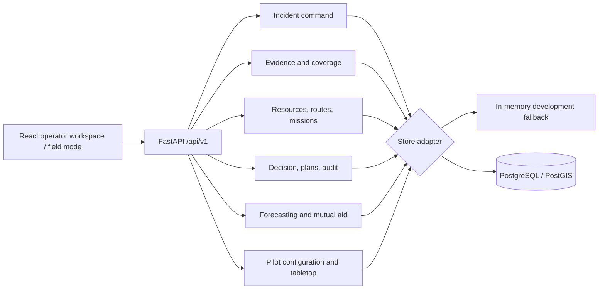

# RescueOps

> **Human-supervised disaster operations for the first 24 hours.**

RescueOps turns incomplete field evidence into accountable, commander-approved action. It keeps confirmed, probable, stale, contradicted, and unknown information visible; checks route and capability constraints; and preserves the path from report to outcome.

```text
Activate incident → assign sectors → receive evidence → verify → create mission
→ check capability and route → commander approval → field update → outcome → handover
```

It is not an autonomous dispatcher, public-alert originator, or generic heat-map dashboard.

## Why RescueOps

During a disaster, report volume is not need. A connected urban area can overwhelm a queue while an isolated settlement goes silent. A nearby resource may be unsuitable, committed, or unable to cross a newly blocked corridor.

RescueOps makes six commitments:

- **Silence is not safety:** unassessed and communications-dark areas stay visible.
- **Evidence precedes action:** source, age, confidence, conflict, and review state travel with a decision.
- **Capability beats proximity:** resources are checked for readiness, capability, and route constraints.
- **Human authority is explicit:** a commander approves, rejects, pauses, or overrides high-risk action.
- **Degradation is honest:** offline, stale, queued, rejected, and synthetic states are visible.
- **Outcomes matter:** completion and handover retain operational context for the next shift.

## Current scope

This is a **tabletop-ready MVP**, not a production deployment for first responders.

| Area | Status |
|---|---|
| Incident, roles, sectors, reports, review, duplicates, contradictions | Implemented |
| Coverage debt, verification ranking, route/readiness constraints | Implemented |
| Missions, capability-aware assignment, approval, lifecycle, outcomes | Implemented |
| Plans, selective invalidation, mutual-aid drafts, SITREP | Implemented |
| Local offline command queue and reconciliation record | Implemented; accepted task commands are **not yet applied** to task state |
| Synthetic replay and fault tabletop | Implemented and labelled synthetic |
| PostgreSQL/PostGIS migrations and adapter tests | Present; database tests skip without a reachable database |
| Production OAuth/OIDC, real agency feeds, live field deployment | Not implemented |

See [current status](docs/PROJECT_STATUS.md) for limitations that must remain visible in any presentation.

## Architecture



### Stack

- **Frontend:** React 19, TypeScript, Vite, Leaflet / React-Leaflet dependencies
- **Backend:** Python 3.12–3.13, FastAPI, Pydantic, Uvicorn
- **Data:** PostgreSQL + PostGIS migrations; deterministic in-memory adapters for development/tests
- **Reliability:** scoped requests, idempotency, correlation IDs, problem+json errors, audit records, offline outbox
- **Quality:** pytest, Ruff, TypeScript/Vite build, PostgreSQL adapter tests when a database is available

## Run locally

### Prerequisites

Python 3.12 or 3.13, Node.js 22+, npm. Docker + Compose is optional for PostgreSQL/PostGIS.

### Install

```bash
python3 -m venv .venv
.venv/bin/python -m pip install -e "./backend[dev]"
npm --prefix frontend install
```

### Development/tabletop mode

If PostgreSQL is unavailable, the non-production app automatically selects in-memory stores. Data resets when the backend restarts.

```bash
cd backend
../.venv/bin/uvicorn app.main:app --reload --host 127.0.0.1 --port 8000
```

In another terminal:

```bash
npm --prefix frontend run dev
```

Open the Vite URL, normally `http://127.0.0.1:5173`.

### PostgreSQL/PostGIS mode

```bash
docker compose -f infra/compose.yaml up -d --wait
cd backend
../.venv/bin/python -m app.persistence
../.venv/bin/uvicorn app.main:app --reload --host 127.0.0.1 --port 8000
```

The default development URL is `postgresql://postgres@127.0.0.1:5432/ev2`. Migrations are forward-only through `0023_pilot_readiness.sql`.

### Development identity

```bash
curl -H 'X-Dev-Identity: operator' http://127.0.0.1:8000/api/v1/dev/context
```

`operator` is a local fixture only. It is not production authentication.

## Presentation flow

1. Activate an incident and assign sectors.
2. Submit and review a report; show evidence and verification state.
3. Create a mission from corroborated evidence.
4. Select a ready, capable resource and have the commander approve it.
5. Advance the task and record a structured outcome.
6. Show offline work only as **queued for reconciliation**, never as already applied state.
7. Generate a SITREP and run the explicitly synthetic fault tabletop.

The tabletop exercises a connectivity outage, duplicate report, blocked corridor, silent village, and reconnection. Its metrics are fixture outputs, not live field-performance claims.

## API

All endpoints are under `/api/v1`; OpenAPI is available at `http://127.0.0.1:8000/docs` in non-production mode.

| Domain | Examples |
|---|---|
| Command | `/command/incidents`, `/command/incidents/{id}/sectors` |
| Evidence and map | `/reports`, `/reports/{id}/review`, `/map/features` |
| Coverage | `/coverage/cells`, `/coverage/verification-ranking` |
| Missions and operations | `/missions`, `/resources`, `/route-observations`, `/tasks` |
| Decisions | `/decision-loop/recommendations`, `/plans`, `/decision-certificates` |
| Mutual aid | `/resource-forecasts`, `/resource-requests/{id}/approve` |
| Resilience and pilot | `/offline-sync`, `/exports/sitrep`, `/pilot/exercises/tabletop` |

Read [roles and scopes](contracts/v1/roles-and-scopes.md) and the [glossary](contracts/v1/glossary.md) before integrating a client. Report creation requires an idempotency key matching `client_record_id`.

## Validate

```bash
cd backend
../.venv/bin/ruff format --check app tests
../.venv/bin/ruff check app tests
../.venv/bin/python -m pytest -q

cd ../frontend
npm run build
```

PostgreSQL tests skip when the database is unavailable. A passing in-memory suite is not proof of database deployment correctness.

## Documentation

- [Product execution plan](docs/RescueOps_Product_Execution_Plan.md)
- [Implementation plan](docs/RescueOps_Implementation_Plan.md)
- [UI revamp handoff](docs/RescueOps_UI_Revamp_Plan.md)
- [Current status](docs/PROJECT_STATUS.md)
- [Roles and scopes](contracts/v1/roles-and-scopes.md)
- [Glossary](contracts/v1/glossary.md)

## Safety boundary

RescueOps must not autonomously dispatch high-risk missions, declare a silent location safe, expose sensitive precise locations without need-to-know authorization, replace command/medical/aviation/structural authority, or present synthetic information as live data.

Before real field use: deploy and test PostgreSQL/PostGIS, introduce approved identity and jurisdiction controls, apply offline commands server-side with conflict review, complete security/privacy work, connect only authorized agency feeds, and run supervised exercises.

## License

No license file is present. All rights are reserved unless maintainers add a license.
