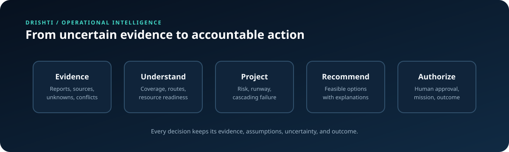
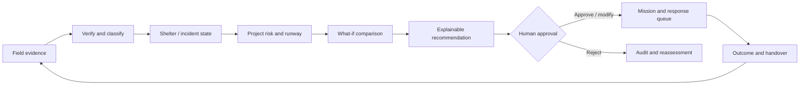
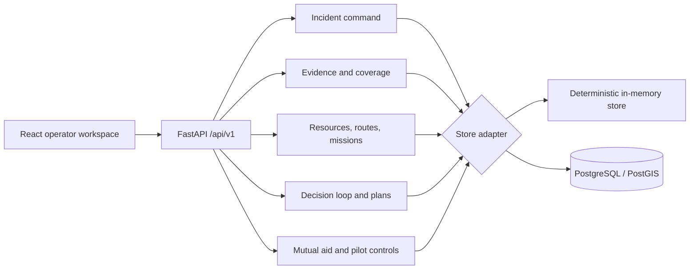

# DRISHTI

> **Human-supervised disaster operations for the first 24 hours.**

DRISHTI is an operational decision-support platform for emergency commanders. It turns incomplete, conflicting, and sometimes stale field information into accountable response actions—while keeping uncertainty visible and human approval in control.

It is designed around a simple question:

> **What needs attention next, what can we do about it, and what evidence supports that decision?**

DRISHTI is a tabletop-ready hackathon MVP. It is not a production dispatch system, a public-alert service, or an autonomous command platform.

<p align="center">
  
</p>

<p align="center"><em>The animated loop illustrates the product thesis: uncertainty becomes a supervised, explainable operational decision.</em></p>

## The problem

In a disaster, the loudest area is not always the area with the greatest need. A report can be duplicated, contradictory, outdated, or impossible to reach. A nearby vehicle may be committed, not ready, or missing the capability required for the task. A location with no reports may be silent—not safe.

DRISHTI treats response as a chain of decisions rather than a collection of map pins:

```text
Activate incident
  → assign sectors
  → collect and review evidence
  → expose coverage gaps and unknowns
  → compare feasible response options
  → request commander approval
  → deploy and track a mission
  → record outcome and handover context
```



<details>
<summary>How to read the loop</summary>

`Evidence` is never silently converted into certainty. DRISHTI carries freshness, contradiction, reporting impairment, route feasibility, and resource constraints into the projected state. Recommendations remain proposals until a commander makes the operational decision; outcomes then feed the next assessment.

</details>

## What makes DRISHTI different

- **Silence is not safety.** Reporting gaps and communications-dark areas remain visible as operational uncertainty.
- **Evidence precedes action.** Source, age, confidence, contradictions, privacy class, and review state travel with the report and decision.
- **Capability beats proximity.** Candidate resources are checked for readiness, capability, task conflicts, and route feasibility.
- **Recommendations are explainable.** Each recommendation exposes its reasons, evidence references, unknowns, assumptions, cost, expected effect, and confidence.
- **Authority is explicit.** High-risk actions are proposed by the system but approved, modified, rejected, paused, and completed by people.
- **Degradation is honest.** Offline work is shown as locally queued and awaiting reconciliation; synthetic data is labelled instead of presented as live truth.
- **Outcomes close the loop.** A mission is not complete until its operational outcome and handover context are recorded.

## The operator experience

The React workspace is organized around the questions an incident commander must answer:

1. **What is happening?** Review reports, claims, map features, route conditions, resource readiness, and coverage debt.
2. **What is uncertain?** See stale, contradicted, unverified, and communications-dark locations instead of hiding them behind one score.
3. **What should happen next?** Generate a deterministic recommendation from the current operational state.
4. **Can it actually happen?** Compare resource capability, readiness, route status, conflicts, and infrastructure dependencies.
5. **Who authorized it?** Approve, modify, or reject the proposed action; no high-risk action is auto-dispatched.
6. **What happened?** Progress the mission, capture a structured outcome, and produce a SITREP or handover record.

The built-in tabletop replay demonstrates a synthetic scenario containing water-risk attention, a contradictory population signal, a silent settlement, a blocked corridor, constrained resources, and reconnection after an outage.

## Current capabilities

| Capability | What it provides |
| --- | --- |
| Incident command | Incidents, roles, sectors, activation, and scoped command context |
| Evidence workbench | Immutable report originals, normalized claims, review states, duplicates, contradictions, and incident links |
| Coverage intelligence | Coverage cells, reporting impairment, coverage debt, and verification ranking |
| Operational map | Bounded GeoJSON features for incidents, resources, routes, and information gaps |
| Resource feasibility | Readiness, capabilities, route observations, task conflicts, and response queues |
| Decision loop | Scenario replay, cascade evaluation, decision policy, ranked candidates, approval, rejection, and audit |
| Plans and dependencies | Assumptions, selective invalidation, infrastructure dependency graphs, and mission-unlock ranking |
| Mutual aid | Resource forecasts, reserve-floor checks, and approval workflow for resource requests |
| Offline operations | Local outbox, queued commands, reconciliation records, connectivity status, and printable task packets |
| Handover and evaluation | SITREP/CSV export, audit integrity views, deterministic evaluation replay, and synthetic tabletop exercise |
| Pilot boundaries | Workspace mode, feed configuration boundary, retention preview, and LoRaWAN/MQTT ingestion hooks |

## Architecture



### Ownership boundaries

- **Frontend:** React 19, TypeScript, Vite, Leaflet/React-Leaflet; owns presentation, interaction, map rendering, scenario controls, and offline UI.
- **Backend:** Python 3.12–3.13, FastAPI, Pydantic, Uvicorn; owns authorization context, validation, idempotency, operational state, decision policy, audit orchestration, and API delivery.
- **Persistence:** PostgreSQL + PostGIS migrations for durable state, with deterministic in-memory adapters for development and tests.
- **Reliability boundary:** correlation IDs, problem+json errors, request guards, rate limits, idempotency keys, audit records, and an offline outbox.

The backend is intentionally a modular monolith. The project does not require Kafka, Kubernetes, microservices, or autonomous control to demonstrate its core value.

## Quick start

### Prerequisites

- Python 3.12 or 3.13
- Node.js 22 or newer and npm
- Docker Desktop with Compose, only if you want PostgreSQL/PostGIS mode

### Install

From the repository root:

```bash
python3 -m venv .venv
.venv/bin/python -m pip install -e "./backend[dev]"
npm --prefix frontend ci
```

On Windows PowerShell:

```powershell
powershell -ExecutionPolicy Bypass -File .\scripts\setup-backend.ps1
npm.cmd --prefix .\frontend ci
```

### Run development/tabletop mode

This mode works without a database. The backend selects deterministic in-memory stores when PostgreSQL is unavailable; state resets when the backend restarts.

Terminal 1:

```bash
cd backend
../.venv/bin/uvicorn app.main:app --reload --host 127.0.0.1 --port 8000
```

Terminal 2:

```bash
npm --prefix frontend run dev
```

Open [http://127.0.0.1:5173](http://127.0.0.1:5173). The API documentation is available at [http://127.0.0.1:8000/docs](http://127.0.0.1:8000/docs).

On Windows, the convenience launcher starts the database, applies migrations, and launches both applications:

```powershell
powershell -ExecutionPolicy Bypass -File .\scripts\dev.ps1
```

### Run PostgreSQL/PostGIS mode

```bash
docker compose -f infra/compose.yaml up -d --wait
cd backend
../.venv/bin/python -m app.persistence
../.venv/bin/uvicorn app.main:app --reload --host 127.0.0.1 --port 8000
```

The local database defaults to `postgresql://postgres@127.0.0.1:5432/ev2`. Migrations are forward-only and currently run through `0024_recommendation_queue_provenance.sql`.

### Local identity

Development mode uses the fixture identity `operator`:

```bash
curl -H 'X-Dev-Identity: operator' http://127.0.0.1:8000/api/v1/dev/context
```

This header is disabled in production and is not a substitute for OIDC/OAuth authentication.

## Try the demo

For the clearest end-to-end walkthrough:

1. Open the operator workspace and confirm the synthetic-data banner.
2. Activate an incident and assign sectors.
3. Seed or replay the synthetic evidence scenario.
4. Review corroborated, contradicted, stale, and unknown claims.
5. Inspect the map for the silent settlement and blocked corridor.
6. Generate the decision-loop recommendation.
7. Open the recommendation details to inspect evidence, unknowns, assumptions, feasibility, and expected effect.
8. Approve, modify, or reject the action as commander.
9. Progress the resulting mission and record its structured outcome.
10. Run the tabletop exercise or export a SITREP for handover.

The scenario is synthetic. Its numbers and outcomes are fixture outputs for demonstration and evaluation, not field-performance claims.

## Verification

Backend checks:

```bash
cd backend
../.venv/bin/ruff format --check app tests
../.venv/bin/ruff check app tests
../.venv/bin/python -m pytest -q
```

Frontend checks:

```bash
cd frontend
npm run typecheck
npm run build
npm test
```

Optional browser and accessibility checks:

```bash
npx playwright install chromium
npm run test:e2e
npm run test:a11y
```

PostgreSQL integration checks require Docker Desktop:

```bash
docker compose -f infra/compose.integration.yaml up --build --abort-on-container-exit --exit-code-from backend-tests
```

The repository separates in-memory, synthetic browser, and real-integration evidence. A skipped database test is not treated as proof of database correctness.

## API surface

All endpoints are under `/api/v1`. Use the generated OpenAPI document at `/docs` for request and response details.

| Domain | Representative endpoints |
| --- | --- |
| Command | `/command/summary`, `/command/incidents`, `/command/incidents/{id}/sectors` |
| Evidence | `/reports`, `/reports/{id}/review`, `/reports/{id}/incident-links` |
| Coverage and map | `/coverage/cells`, `/coverage/verification-ranking`, `/map/features` |
| Operations | `/resources`, `/response-queue`, `/tasks`, `/route-observations` |
| Decisions | `/decision-loop/demo/replay`, `/decision-loop/recommendations`, `/decision-loop/recommendations/{id}/decision` |
| Scenarios | `/shelter-state/demo/seed`, `/runway/projections`, `/cascade/evaluate`, `/what-if/evaluate` |
| Plans and aid | `/plans`, `/decision-certificates`, `/infrastructure/unlock-ranking`, `/resource-forecasts` |
| Resilience | `/offline-sync`, `/updates`, `/audit/integrity`, `/exports/sitrep` |
| Pilot and feeds | `/pilot/status`, `/pilot/exercises/tabletop`, `/feeds/sync`, `/lorawan/webhook` |

Integrators should read [roles and scopes](contracts/v1/roles-and-scopes.md), the [glossary](contracts/v1/glossary.md), and the JSON schemas in [contracts/v1](contracts/v1). Report creation requires an idempotency key matching `client_record_id`.

## Repository map

```text
backend/
  app/                    FastAPI application and domain modules
  migrations/             PostgreSQL/PostGIS forward-only migrations
  tests/                  Unit, contract, workflow, and integration tests
frontend/
  src/features/operator/  React operator workspace and offline experience
  tests/                  Vitest, Playwright E2E, and accessibility tests
contracts/v1/             Versioned API/event/report schemas and examples
infra/                    Local and integration Compose definitions
scripts/                  Windows setup, development, smoke, security, and replay helpers
docs/                     Architecture notes, release notes, and handoff manifests
load/                     Scoped k6 command-flow load test
```

## Configuration and deployment boundaries

Configuration uses the `EV2_` environment-variable prefix. Common settings include `EV2_APP_ENVIRONMENT`, `EV2_DATABASE_URL`, `EV2_ALLOWED_ORIGINS`, `EV2_DEV_IDENTITY_ENABLED`, and the rate/request limits defined in `backend/app/core/config.py`.

Production requires all of the following:

- `EV2_APP_ENVIRONMENT=production`
- development identity disabled
- HTTPS, non-loopback allowed origins
- a secret-manager supplied database URL
- an external OIDC verifier
- a production telemetry adapter
- durable update-feed and metrics infrastructure

The repository includes deployment definitions for Vercel and Railway, but deployment configuration is not evidence of production readiness. The real-integration Compose file is intentionally an example boundary and does not contain provider credentials.

## Safety and scope

DRISHTI must not autonomously dispatch high-risk missions, declare a silent location safe, expose precise sensitive locations without authorization, replace medical/structural/aviation authority, or present synthetic information as live data.

Before real operational use, the system would require approved identity and jurisdiction controls, tested PostgreSQL/PostGIS deployment, durable telemetry and updates, server-side offline-command reconciliation with conflict review, privacy/security review, authorized agency feeds, rollback testing, and supervised exercises.

## Further reading

- [Release notes](docs/RELEASE_NOTES.md)
- [Architecture alignment status](docs/architecture-alignment-status.md)
- [Architecture implementation gap analysis](docs/architecture-implementation-gap-analysis.md)
- [Reliability and recovery notes](docs/reliability-recovery.md)
- [Operator golden flow](docs/handoffs/operator-workspace/golden-flow.md)
- [Decision-loop handoff](docs/handoffs/decision-policy/manifest.md)
- [What-if handoff](docs/handoffs/what-if/manifest.md)
- [Offline-sync handoff](docs/handoffs/offline-sync/manifest.md)
- [Versioned contracts](contracts/v1)

## License

No license file is currently present. All rights are reserved unless the maintainers add a license.
