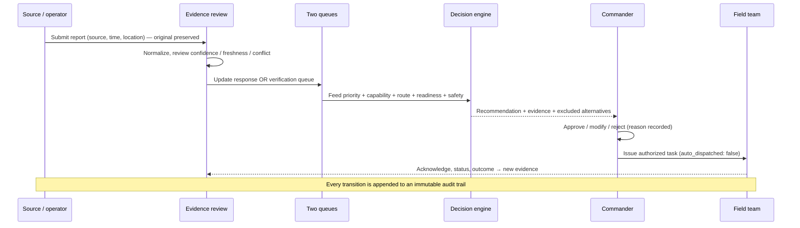
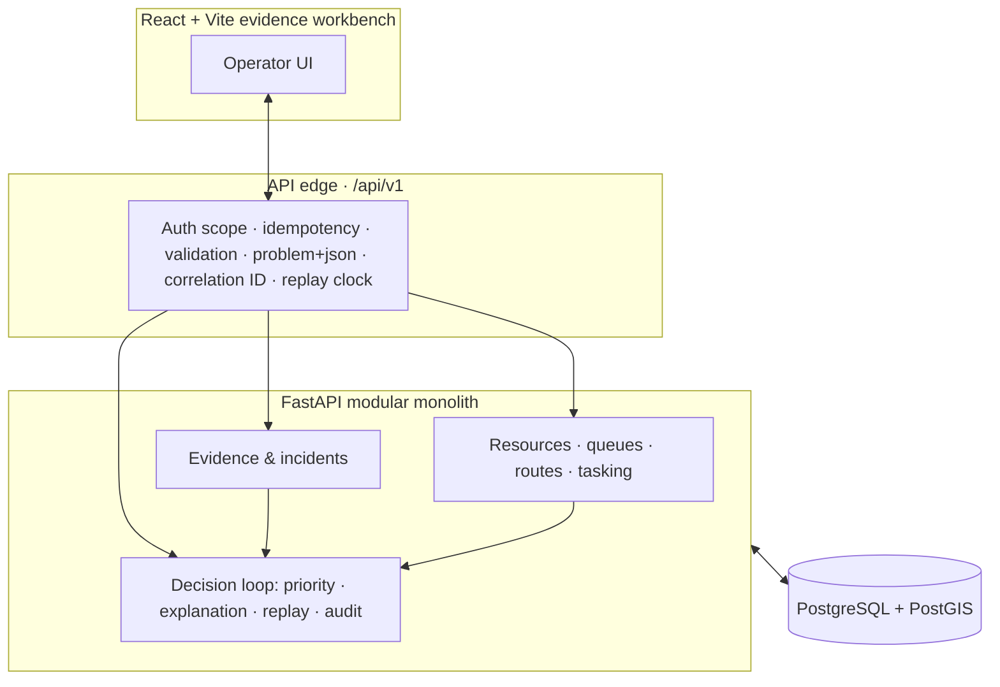

<div align="center">

# D.R.I.S.H.T.I

### Disaster Response Intelligence System for Human Triage Intelligence

**A human-supervised evidence-to-action layer for district disaster response — not another disaster map.**

*Turn incomplete, contradictory, unevenly-distributed reports into explainable verification and response options, then let an authorized commander approve feasible resource assignments. The system advises. It never dispatches on its own.*

`FastAPI` · `PostgreSQL/PostGIS` · `React + Vite` · `Executable JSON-schema contracts` · `Deterministic replay`

</div>

---

> [!IMPORTANT]
> **Status: bounded, runnable demonstration.** This repository is a deliberately scoped hackathon/prototype build of a much larger architecture. It runs the full *evidence → review → recommend → approve → task → audit* loop against **synthetic data** with **development-only identity fixtures**. It makes **no** production-readiness, hosting, cloud, geocoding, ML, or operational-outcome claims. The complete production architecture lives in [`docs/`](docs/) as a design baseline — see [What runs today vs. the full vision](#what-runs-today-vs-the-full-vision).

---

## Table of contents

- [The problem](#the-problem)
- [What makes it different](#what-makes-it-different)
- [The decision loop](#the-decision-loop)
- [Architecture at a glance](#architecture-at-a-glance)
- [What runs today vs. the full vision](#what-runs-today-vs-the-full-vision)
- [Quickstart](#quickstart)
- [Demo runbook](#demo-runbook)
- [API surface](#api-surface)
- [Design principles (the non-negotiables)](#design-principles-the-non-negotiables)
- [Project structure](#project-structure)
- [Team model](#team-model)
- [Documentation](#documentation)
- [Non-goals & safety boundary](#non-goals--safety-boundary)
- [License](#license)

---

## The problem

In the first 24 hours of a flood-plus-landslide/road-blockage event, a District Emergency Operations Centre (EOC) must answer one hard question:

> Given incomplete and contradictory reports, damaged communications and roads, and a limited number of suitable responders and vehicles — **what should be verified or acted on next, and why?**

The operational failure chain is well understood:

1. Information arrives through incompatible channels (calls, radio, field teams, spreadsheets, citizens, drones, satellites).
2. Duplicate, stale, vague, and contradictory reports consume attention.
3. **Reporting density gets mistaken for need** — a connected town floods the queue while an isolated settlement goes dark.
4. Communications-dark areas remain unassessed.
5. Route and resource status change faster than static records.
6. Scarce specialist assets get mismatched or double-booked.
7. Decisions can't later be reconstructed or evaluated.

The objective is **not** to process more reports. It is to reduce the time from *credible need* to *suitable, acknowledged action* — while avoiding unsafe recommendations, duplicate deployment, and systematic neglect of low-connectivity communities.

## What makes it different

Maps, dashboards, chatbots, APIs, and ML are not the innovation. The defensible combination is the **controlled transition from uncertain evidence to a feasible, reviewable action**:

| # | Innovation | What it means in practice |
|---|------------|---------------------------|
| 1 | **Evidence-to-action provenance** | Every recommendation retains the chain: raw source → atomic claim → incident state → policy version → constraints → approval → outcome. |
| 2 | **Immutable evidence, mutable interpretation** | Originals are never deleted or overwritten. Duplicates are *linked*, not erased; independent-source count stays explicit. |
| 3 | **Two linked queues** | A **response queue** (act now) and a **verification queue** (find out) compete for attention explicitly. Uncertainty gets an owner and a next action. |
| 4 | **Missingness-aware coverage** | Silence is never treated as safety. A verification concern is raised only when silence combines with exposure, connectivity loss, access failure, or prior hazard evidence — it creates a *check*, never an automatic rescue. |
| 5 | **Decision-sensitive verification** | A callback/scout/imagery request is ranked by its expected ability to *change a scarce-resource decision*, not merely by high uncertainty. |
| 6 | **Policy-visible allocation** | Life threat, feasibility, safety, wait time, remoteness, and equity are versioned and shown as contributions — not hidden inside a score. |
| 7 | **Human authority, always** | Every life-safety task is approved / modified / rejected by an authorized commander, with reason recorded. No autonomous dispatch. |

## The decision loop

The system implements the smallest complete operational loop and records every step:



A deterministic **replay clock** drives this loop from a fixed synthetic scenario: simulated event time is substituted for wall time, and the system never reads records from the future.

## Architecture at a glance

A **modular monolith** — one FastAPI application with explicit domain modules behind one authenticated boundary. This shape is deliberate: one primary coder can implement, test, deploy, and debug it without distributed-transaction overhead, while module contracts keep it from rotting into a big ball of mud.



**Boundary rules that hold the design together:**

- The API edge owns identity scope, request validation, size/format limits, idempotency keys, correlation IDs, and `application/problem+json` errors.
- **Event time is distinct from server-recorded time** (`observed_at` ≠ `received_at` ≠ `recorded_at`).
- Every write carries tenant, workspace, actor, and an **`Idempotency-Key`** — retries are safe by construction.
- Forward-only SQL migrations (`0001`→`0014`) create evidence, spatial state, operations, decisions, shelter state, security, and jobs/outbox reliability.
- Development identity is **deterministic, deny-by-default, and rejected in production configuration**.

**Stack:** Python 3.12/3.13 · FastAPI · PostgreSQL + PostGIS · React + TypeScript + Vite · JSON-schema contracts validated in tests.

## What runs today vs. the full vision

The [`docs/`](docs/) describe a hardened, partner-deployed district system. **This repo is the bounded first slice of it.** Being explicit about the gap is a feature, not an apology.

| Capability | In this repo | Designed in [`docs/`](docs/) |
|------------|:---:|:---:|
| Evidence-to-action loop (ingest → review → recommend → approve → task → audit) | ✅ | ✅ |
| Immutable reports, review states, incident links | ✅ | ✅ |
| Response + verification queues | ✅ | ✅ |
| Deterministic, **explainable** recommendation + counterfactual exclusions | ✅ | ✅ |
| Commander approval, no double-booking, `auto_dispatched: false` | ✅ | ✅ |
| Deterministic replay clock + append-only audit | ✅ | ✅ |
| PostgreSQL/PostGIS migrations + Postgres-backed tests | ✅ | ✅ |
| Bounded map features / sector coverage (data) | ✅ | ✅ |
| Executable JSON-schema contracts | ✅ | ✅ |
| Real OIDC / MFA identity | 🔧 dev fixtures only | ✅ |
| Offline field PWA + IndexedDB sync | 🔧 bounded demo workflow | ✅ |
| Object storage for media / rasters | ❌ | ✅ |
| OR-Tools constrained solver | 🔧 deterministic rules + greedy | ✅ |
| MapLibre map rendering | ❌ (data endpoints only) | ✅ |
| WebSockets realtime, external adapters (CAP/STAC/ERSS/IDRN), geocoding, ML/imagery | ❌ | ✅ (as isolated, optional adapters) |

✅ built · 🔧 partial / demo-grade · ❌ deliberately deferred

## Quickstart

### What you will run

The local stack has three pieces: PostgreSQL/PostGIS in Docker, a FastAPI API, and a React/Vite operator workspace. The browser uses the real API golden flow; development identity is a fixed local fixture and is never a production authentication claim.

**Prerequisites**

- Python **3.12 or 3.13**
- Node.js **22+**
- Docker with Compose (for PostgreSQL/PostGIS)

No secret-bearing file is required for the development profile.

**One-time setup** (PowerShell, Windows-first):

```powershell
py -m venv .venv
.\.venv\Scripts\python.exe -m pip install -e ".\backend[dev]"
npm.cmd --prefix .\frontend install
```

**Start the local stack:**

```powershell
.\scripts\dev.ps1
```

This starts the PostGIS container, applies migrations, then runs the API at `http://127.0.0.1:8000` and the frontend at `http://127.0.0.1:5173` (it auto-selects the next free port if `5173` is taken and prints the URL). `Ctrl+C` stops the app processes; the database container stays up for faster restarts.

For separate terminals:

```powershell
docker compose -f .\infra\compose.yaml up -d --wait database
Push-Location .\backend
..\.venv\Scripts\python.exe -m app.persistence
..\.venv\Scripts\python.exe -m uvicorn app.main:app --reload --host 127.0.0.1 --port 8000
Pop-Location
npm.cmd --prefix .\frontend run dev
```

**Probe the development identity** (the `operator` fixture only works when the typed config enables the non-production fixture):

```powershell
Invoke-RestMethod -Headers @{ 'X-Dev-Identity' = 'operator' } http://127.0.0.1:8000/api/v1/dev/context
```

**Validate everything** (backend format/lint, backend tests incl. contract validation, frontend TypeScript build):

```powershell
.\scripts\check.ps1
```

## Demo runbook

The browser automatically resets and loads the live golden flow. The sequence is replay → ranked interventions → commander decision → route confirmation → manual assignment → acknowledgement → en route → completion/outcome → audit.

Start the stack with `.\scripts\dev.ps1`. In a second PowerShell window, reset the fixed synthetic scenario:

```powershell
$h = @{ 'X-Dev-Identity' = 'operator'; 'Idempotency-Key' = 'demo-replay-001' }
Invoke-RestMethod -Method Post -Headers $h http://127.0.0.1:8000/api/v1/decision-loop/demo/replay
```

The 3–5 minute judge flow ([docs/handoffs/phase-6/manifest.md](docs/handoffs/phase-6/manifest.md)):

1. Open the React shell; identify the synthetic/operator development context.
2. Run the reset command above — a reproducible starting state.
3. Open the decision-loop scenario: short water runway, elevated contamination, expected influx.
4. Generate a recommendation. Point at the **rule name, each reason, and the filtered ready water-team resource**.
5. Approve it as commander. Show `approved` **plus `auto_dispatched: false`** — and that the task list is still empty (no autonomous dispatch).
6. Open the audit view: replay, recommendation, and approval events are all recorded.
7. Optionally create a response-queue item and manually assign it — demonstrating the separate, human-controlled dispatch boundary.

### Reproducible evidence commands

```powershell
.\scripts\check.ps1
.\scripts\run-evaluation-replay.ps1
.\scripts\reliability-recovery.ps1
```

The recovery script writes `artifacts/recovery/ev2-seeded.dump`, restores only to `ev2_recovery_demo`, compares report/audit counts and audit hash, and fails closed if Docker or the target name is unsafe.

## API surface

All endpoints are under `/api/v1`. Reads require a read scope; **every write requires an `Idempotency-Key` header** and the matching write scope. Errors are `application/problem+json` with a stable `code`, `correlation_id`, and `retryable` flag.

| Group | Endpoints |
|-------|-----------|
| **System** | `GET /health/live` · `GET /health/ready` · `GET /version` · `GET /metrics` |
| **Development** | `GET /dev/context` |
| **Evidence** | `POST /reports` · `GET /reports` · `GET /reports/{id}` · `POST /reports/{id}/review` · `POST /reports/{id}/incident-links` · `GET /incidents` · `POST /demo/seed` |
| **Geospatial** | `GET /sectors` · `GET /map/features?bbox=…` |
| **Operations** | `GET /resources` · `PATCH /resources/{id}/readiness` · `POST/GET /response-queue` · `POST /response-queue/{id}/approve` · `POST/GET /verification-queue` · `POST/GET /route-observations` · `GET /tasks` · `PATCH /tasks/{id}` · `POST /operations/demo/seed` |
| **Decision loop** | `POST /decision-loop/demo/replay` · `GET /decision-loop/scenario` · `POST /decision-loop/recommendations` · `POST /decision-loop/recommendations/{id}/decision` · `GET /decision-loop/audit` |
| **Updates** | `GET /updates?cursor=...&limit=...` · `POST /updates` (safe demo publisher) |

Interactive OpenAPI docs are served at `http://127.0.0.1:8000/docs` while the API runs.

**Idempotency note:** for `POST /reports`, the `Idempotency-Key` must equal the report's `client_record_id`; a repeated key with a *different* payload returns `409 IDEMPOTENCY_CONFLICT`, and a repeat with the *same* payload returns the original result with `deduplicated_replay: true`.

## Design principles (the non-negotiables)

These are enforced, not aspirational — they map to the project's Architecture Decision Records:

- **Human authority.** Every life-safety recommendation requires explicit approve/modify/reject. `auto_dispatched` is always `false`. *(ADR-008, non-negotiable)*
- **Immutable raw evidence.** An accepted original is never overwritten or deleted to represent a review change. *(ADR-003, non-negotiable)*
- **Unknown is first-class.** No report ≠ safety. Missingness can create verification, never automatic rescue.
- **Rules before models.** Deterministic, transparent policy with a greedy fallback — auditable and reproducible with sparse local data. *(ADR-005)*
- **Modular before distributed.** One deployable app; workers/services are extracted only on *measured* need. *(ADR-001)*
- **Bounded & idempotent.** Request size, retries, and commands are bounded; database constraints (not in-memory locks) own correctness.

## Project structure

```
.
├── backend/                 FastAPI modular monolith
│   ├── app/
│   │   ├── api/routes.py     All /api/v1 endpoints
│   │   ├── core/             clock · config · context (scopes) · errors · middleware
│   │   ├── evidence.py       Reports, review, incidents, sectors, map features
│   │   ├── operations.py     Resources, queues, routes, tasking, approval
│   │   ├── decision_loop.py  Scenario, recommendation, decision, replay, audit
│   │   └── persistence.py    PostgreSQL/PostGIS readiness + adapters
│   ├── migrations/           Forward-only SQL (0001 → 0014)
│   └── tests/                unit · contract · Postgres-backed integration
├── frontend/                 React + Vite + TypeScript evidence workbench
│   └── src/                  App.tsx · api.ts · main.tsx · styles.css
├── contracts/v1/             Executable JSON-schema contracts + examples + glossary + roles
├── infra/compose.yaml        Local PostgreSQL/PostGIS
├── scripts/                  dev.ps1 (run) · check.ps1 (validate)
└── docs/                     Full architecture, overview, phase handoffs (see below)
```

## Team model

The architecture is built for a **three-person split** where only one person does most production coding, and ownership is divided by *decision artifacts* rather than fake services:

- **Person 1 — Primary coder / integration lead:** module boundaries, API, database, frontend, deployment.
- **Person 2 — Research / algorithm lead:** vocabulary, priority/coverage/VoI/allocation formulas, labeled replay dataset, test vectors, evaluation.
- **Person 3 — Systems / validation / product lead:** UX & API acceptance specs, threat model, benchmarks, runbooks, demo evidence.

Contracts are frozen collaboratively early so Persons 2 and 3 produce executable artifacts without waiting on the UI or backend. See [SYSTEM_ARCHITECTURE §27](docs/SYSTEM_ARCHITECTURE.md).

## Documentation

| Document | What it is |
|----------|------------|
| [PROJECT_OVERVIEW.md](docs/PROJECT_OVERVIEW.md) | Standalone research & planning baseline — problem, evidence, gap analysis, requirements, scope, roadmap, evaluation. Every external claim is labeled by evidence strength. |
| [SYSTEM_ARCHITECTURE.md](docs/SYSTEM_ARCHITECTURE.md) | The frozen implementation architecture — 40 sections, C4-style diagrams, data model, storage, security, threat model, ADRs, and implementation order. |
| [IMPLEMENTATION_PLAN_6_PHASES.md](docs/IMPLEMENTATION_PLAN_6_PHASES.md) | The phased build plan this repo followed. |
| [architecture-implementation-gap-analysis.md](docs/architecture-implementation-gap-analysis.md) | Honest accounting of design vs. what's implemented. |
| [RELEASE_NOTES.md](docs/RELEASE_NOTES.md) | Demo checkpoint notes. |
| [docs/handoffs/](docs/handoffs/) | Per-phase manifests and bug logs. |
| [contracts/v1/](contracts/v1/) | The frozen semantic contracts (schemas, glossary, roles & scopes). |

## Non-goals & safety boundary

This system is **advisory decision support**, not the emergency service, the command authority, or an early-warning originator. It explicitly does **not**:

- perform autonomous dispatch or originate public warnings;
- declare a location safe because it is silent;
- produce automated casualty counts or survival predictions;
- replace ERSS / SACHET / IDRN / Bhuvan or any agency system of record.

The full out-of-scope list and the safety case are in [PROJECT_OVERVIEW §20–22](docs/PROJECT_OVERVIEW.md) and [SYSTEM_ARCHITECTURE §36](docs/SYSTEM_ARCHITECTURE.md). A real pilot requires an external operational authority, legal review, and partner sign-off — none of which this demo assumes.

## License

No license file is currently present in this repository. Until a `LICENSE` is added, no usage rights are granted by default; treat the code as **all rights reserved** and contact the maintainers before reuse. Third-party dependencies retain their own licenses (an SBOM and data-license register are planned per the architecture).
